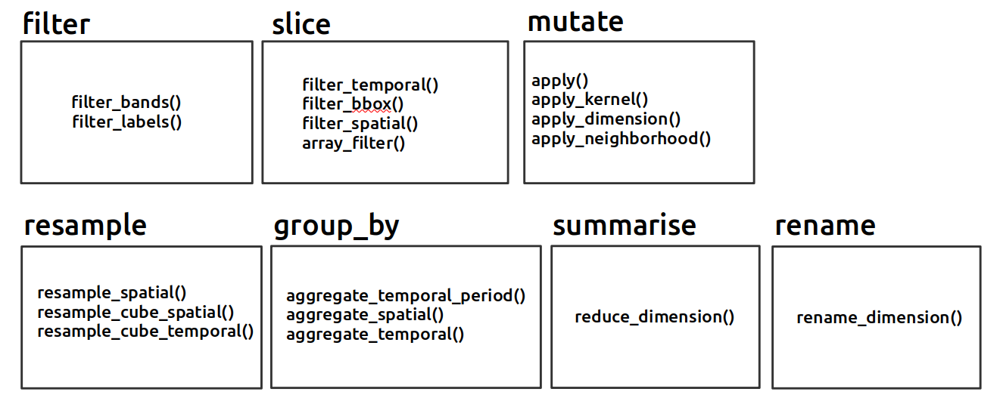

```{r, include = FALSE}
knitr::opts_chunk$set(
  collapse = TRUE,
  comment = "#>"
)
```

The **tidyopeneo** package was created with the intention to make the [openeo](https://cran.r-project.org/web/packages/openeo/index.html) package processes more flexible. This is due to the fact that the openeo processes are usually too "APIish". Therefore, so far, when using openeo processes, the feeling is mainly that you are not handling R code, but a specific API. For example, when trying a simple [filter_bands()](https://processes.openeo.org/#filter_bands), the code would look as something like this:

```{r processes, echo=TRUE}
library(openeo)

con = connect(host = "https://openeo.cloud")
p = processes()

dc = p$load_collection(
               id = "SENTINEL_5P_L2",
               spatial_extent = list(west = 6.09, south = 46.15, east = 6.99, north = 46.57),
               temporal_extent=c("2018-07-01", "2018-10-31")
             )

dc_no2 = p$filter_bands(data = dc, bands = "NO2")

```

The user always needs to call a *processes()* object and call the desired function from it using the dollar sign ("$"). Moreover, we need to remember too many of these processes in order to use them. That is exactly where the tidyverse comes into the scene. The methods from *dplyr* are quite straightforward and natural, and for this reason many tools and scripts are being converted into this so called "universe". In that sense, why not wrap some of the main openEO processes into *dplyr* functions? Why could not datacubes be treated similarly to data frames / tibbles. Therefore, the aim here was to wrap some of the processes from the openEO API into dplyr's functions, such as the famous *filter*, *mutate*, *filter*, and so on. A guide on how exactly this was wrapped can be seen in the figure below.



Pay attention to the fact that all the functions were wrapped into dplyr's function, in exception to *resample*, which was fully newly created. For this specific case, this is more of an experiment to analyse whether just wrapping into dplyr functions is enough or maybe new functions could also be accepted. In general, as the idea is also to simplify openEO API processes, this came quickly to mind. For sure, as this is work in progress, more processes and wrapped functions might show up. Another important topic refers to **group_by** and **summarise**. The idea is to have something very similar as in dplyr, where one first aggregates the data and later uses *summarise* on the aggregated data. The same logic applies. The **group_by** here will aggregate the cube per day, per geometry or time interval and lately, **summarise** will be applied. The **groub_by** simply creates a subclass called "grouped datacube", whilst saving the ".by" argument into the environment of the "grouped datacube" object, which is then retrieved by **summarise**. If the datacube in question is not a "grouped datacube", simply "reduce_dimension" process is run.    

The hope is that with the development of this package, more people from the R community will feel like using openEO for Earth Observation tasks. 

With the mission to aggregate and simplify some of the main processes from openeo, below one may see a first example on how to call the class "datacube" from tidyopeneo, which is understood as the first step when working with the package. The class "datacube" already sets a connection with openeo.cloud and only requires the id argument. One can also pass it to another "ProcessNode" object from openeo too.

```{r setup}
knitr::opts_chunk$set(echo = TRUE)
library(tidyopeneo)
library(sf)

dc = datacube(id = "SENTINEL_5P_L2")
```

## filter

From now on, we can work completely in a *tidy* syntax and use even the infamous pipes ( %>% ). The first example below demonstrates the **filter_bands** process and how it is wrapped in tidyopeneo. 

```{r filter, echo=TRUE}
dc_select = dc %>% select(.bands = "NO2")
dc_select = dc %>% select(.bands = "CO2")
```

It also includes four other different processes. Let's have a look at some of them.

```{r filter 2, echo=TRUE}
dc_filtered = dc_select %>% 
  filter(.extent = c("2018-01-01", "2018-01-02")) %>% #filter_temporal
  filter(.extent = list(west = 6.09, south = 46.15, east = 6.99, north = 46.57)) #filter_bbox

#filter_spatial
lon = c(6.22, 6.24)
lat = c(46.20, 46.25)
pol_coords = dplyr::tibble(lon, lat)
pol <- pol_coords %>%
     st_as_sf(coords = c("lon", "lat"), crs = 3857) %>%
     st_bbox() %>%
     st_as_sfc()

dc_filtered = dc_select %>% filter(.geometries = pol)
```

Have a look on how we define the filter and how much it looks like a dplyr workflow. It is also important to mention that depending on the arguments that are passed, the wrapper function will deploy a different process. For knowing that, make sure to check not only the documentation of the wrapper functions, but also of the openeo processes. The parameters will be the same, although in tidyopeneo they can be all mixed up in one single function (the whole idea of the wrapper).

## mutate

The **mutate()** function is also a big wrapper. It includes four processes again and they are all *apply* processes. In those terms, the example below demonstrates the use of this wrapper :

```{r mutate, echo = TRUE}
dc_cloud = dc %>% 
  filter(.extent = c("2018-01-01", "2018-01-02")) %>% #filter_temporal
  filter(.extent = list(west = 6.09, south = 46.15, east = 6.99, north = 46.57)) %>%  #filter_bbox
  select(.bands = "CLOUD_FRACTION")

## mask for cloud cover
threshold_ <- function(data, context) {
  p = openeo::processes()
  threshold <- p$gte(data[1], 0.5)
  return(threshold)
}

# apply the threshold to the cube
cloud_threshold = dc_cloud %>% 
  mutate(.process = threshold_)

# mask the cloud cover with the calculated mask
dc_masked <- p$mask(dc_filtered, cloud_threshold)
```

Here what also comes to hand is that you can use openEO API processes as usual on "datacube" classes from tidyopeneo. This is pretty useful, and the other way around is also possible, if the datacube() constructor is used to recreate a "datacube " class. 

## rename

The rename() function wraps only rename_dimension process. In this, the main idea is just to be able to call the functions inside the pipes. 

```{r rename, echo = TRUE}
dc_rename = dc_filtered %>% rename(.source = "t", .target = "time")
```

Another interesting point of tidyopeneo is to have more examples of the multiple usages coming from the different API processes. This is still lacking in openEO documentation and it is believed this package could help. This is all been built. 

## resample

As stated, resample() is the single function in the actual stage of tidyopeneo that is not coming from dplyr, but it is a complete new function. It is ment as an example of a way to simplify different processes into one single wrapped function. 

```{r resample, echo = TRUE}
dc_resample = dc_filtered %>% resample(.resolution = 10/111)
```

## summarise

The understanding of summarise in tidyopeneo is quite different than the one in dplyr. In spite of working on the column level, summarise works on all pixels of a given dimension and it wraps the reduce_dimension process. Again, a single function for a single process, therefore allowing it to run in magrittr pipes. 

```{r summarise, echo = TRUE}
dc_summarised = dc_resample %>% summarise(.reducer = "mean")
```

It is important to mention that if you are more familiar with the American English version of summarise, i.e., summarize, this is also available, just like in dplyr. 

## group_by

Finally, we have the group_by() function, which, as mentioned, only creates a subclass of the datacube class. "grouped datacube". Here are some example of how to make it interact with **summarise**. 

```{r group_by, echo = TRUE}
dc_sum <- dc_resample %>%
  group_by("t") %>%
  summarise("sum")

dc_sum <- dc_resample %>%
  group_by("space") %>%
  summarise("sum")
```

And just for you to notice the subclass...

```{r}
dc_grouped <- dc_resample %>% group_by("day")
dc_grouped %>% class() %>% print()
```
